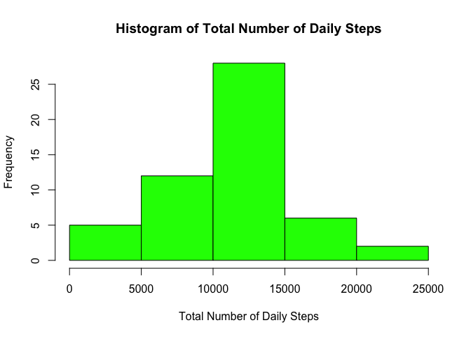
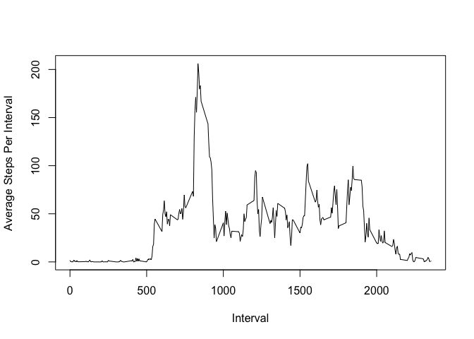
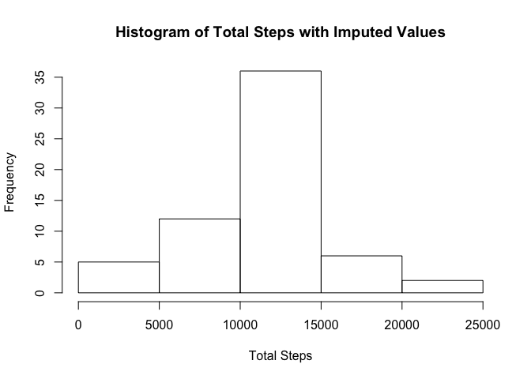
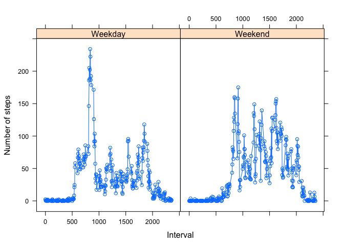

# PA1_template.Rmd
Tom Ward  
7/16/2017  


Read the file into a dataframe using read.csv:


```r
df <- read.csv("activity.csv")
```


```r
steps <- group_by(df,date)
steps_summ <- summarise(steps,sum_steps = sum(steps))
hist(steps_summ$sum_steps, col = "green",main = "Histogram of Total Number of Daily Steps",xlab = "Total Number of Daily Steps")
```

<!-- -->

```r
step_mean <- mean(steps_summ$sum_steps,na.rm = TRUE)
step_median <- median(steps_summ$sum_steps,na.rm = TRUE)
```

The mean total number of steps is 1.0766189\times 10^{4}.

The median total number of steps is 10765.


```r
avg_df <- group_by(df,interval)
int_df <- summarise(avg_df,avg_steps_int = mean(steps,na.rm = TRUE))
plot(int_df$interval,int_df$avg_steps_int,type="l",xlab="Interval",ylab="Average Steps Per Interval")
```

<!-- -->

```r
high <- max(int_df$avg_steps_int)
```

The highest total number of steps for an interval on average was 206.1698113.


```r
number_of_nas <- sum(is.na(df))
df1 <- df
df1$steps[which(is.na(df1$steps))] <- mean(df1$steps,na.rm = TRUE)
steps_imputed <- group_by(df1,date)
steps_imputed_summ <- summarise(steps_imputed,sum_imputed_steps = sum(steps))
hist(steps_imputed_summ$sum_imputed_steps,main="Histogram of Total Steps with Imputed Values",xlab="Total Steps")
```

<!-- -->

```r
mean_imp <- mean(steps_imputed_summ$sum_imputed_steps,na.rm = TRUE)
median_imp <- median(steps_imputed_summ$sum_imputed_steps,na.rm = TRUE)
```

There are 2304 rows that contain NAs.

After imputing values using the average number of steps across intervals, the mean is 1.0766189\times 10^{4} and the median is 1.0766189\times 10^{4}. 


```r
df$date <- as.Date(df$date)
df$day_type <- weekdays(df$date)
df$week[df$day_type == "Monday"] <- "Weekday"
df$week[df$day_type == "Tuesday"] <- "Weekday"
df$week[df$day_type == "Wednesday"] <- "Weekday"
df$week[df$day_type == "Thursday"] <- "Weekday"
df$week[df$day_type == "Friday"] <- "Weekday"
df$week[df$day_type == "Saturday"] <- "Weekend"
df$week[df$day_type == "Sunday"] <- "Weekend"

avg_df <- group_by(df,interval,week)
int_df <- summarise(avg_df,avg_steps_int = mean(steps,na.rm = TRUE))
xyplot(avg_steps_int ~ interval|week,data = int_df, type="b",ylab="Number of steps",xlab="Interval")
```

<!-- -->


